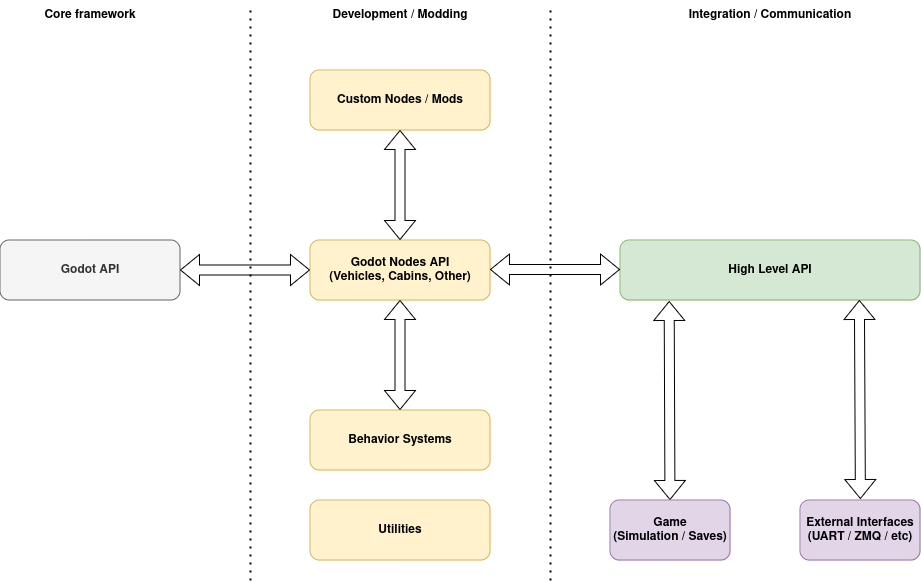
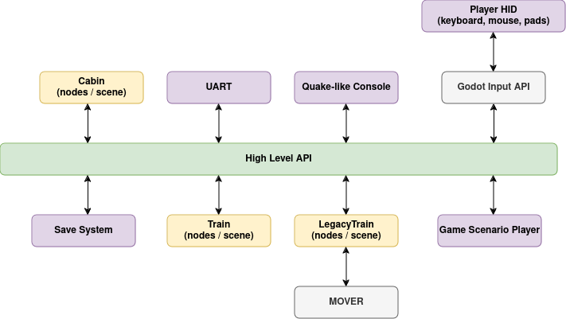

* Godot Engine as the core of the project: **Rendering**,
  **Multiplayer**, **Sound**, **Assets Pipeline**, **Utilities**,
  **Node system**, **Resources handling**, **Scene system**,
  **Input system**, **GDExtension** as programming interface
* High-Level API for two-way communication between all high-level components and external systems
* Godot Nodes interface for internal communication (inside a high-level
  components)


### Diagrams

#### Overall architecture



#### Communication example diagram



### High-Level Components

High-Level Components should be identified as a complete and standalone
objects in the game, which encapsulates it's behavior and rendering.
They should work just by adding them to the scene.

Examples of High-Level Components in the game:
- train vehicle
- complete cabin for a vehicle
- car
- building or element of the railway infrastructure (i.e. semaphore)
- Quake-like Console
- game's scenario system
- UART communication system

#### Communication between game objects

The communication between High-Level Components (a game objects) **must be**
implemented through **High-Level API** like **TrainSystem**, **CabinSystem**.

The communication is based on commands identified by unique string names. Commands are handled by High-Level API
dispatchers like **TrainSystem**, where every vehicle or it's element can register own commands and handlers. Every
game object can handle own subset of all commands, which can be inspected at runtime. Adding and removing commands
is also possible at runtime, because commands are dynamic.

For example, to enable battery in `train1` vehicle, you need to send a command like this:
```gdscript
TrainSystem.send_command("train1", "battery", true)
```

Communication is asynchronous, because command execution may take the time (i.e. some systems must spin up). To check if
the command was executed successfully, you must inspect the vehicle state:

```gdscript
TrainSystem.get_train_state("train1").get("battery_enabled")
```

> **_NOTE_**
> In the future some feedback may be exposed through High-Level API signals 


#### Internal communication

High-Level Components are usually built from many sub-components, which will
handle a subset of a logic or rendering. The communication between these
components is private, should be fastest as possible and
straightforward. Because HLC (High-Level Component) know it's internal
structure, it can communicate with subcompones using direct method
calls, accessing properties, signals.

Because there is no reasons to use High-Level APIs for internal communication,
nodes usually have public interface by plain methods and properties:

```gdscript
extends TrainPart

var internal_state: bool = false

func operate_something(new_state:bool):
    # some logic here
    internal_state = new_state
```

But part of these methos can be also bound as command handlers for
High-Level API:

```gdscript
extends TrainPart

var internal_state: bool = false

func _enter_tree():
    register_command("operate_custom_part", self.operate_something)

func _exit_tree():
    unregister_command("operate_custom_part", self.operate_something)

func operate_something(new_state:bool):
    # some logic here
    internal_state = new_state
```

Assume that there is a custom train composed like this, which has name
set to `example_train`.

```
+ TrainController
  +-- TrainPart (with attached script as above)
```

Because `TrainController` "knows" the structure, it's script can communicate
with `TrainPart` directly:

```gdscript
extends TrainController

func _process(delta):
    if something:
        $TrainPart.operate_something(true)
```

But any other game objects (HLCs) should call `operate_something()`
through **CommandsAPI**:

```gdscript

func _process(delta):
    if something:
        TrainSystem.send_command(
            "example_train", "operate_custom_part", true)
```

This approach hides internal structure of the vehicle and creates a
stable interface between game components.
