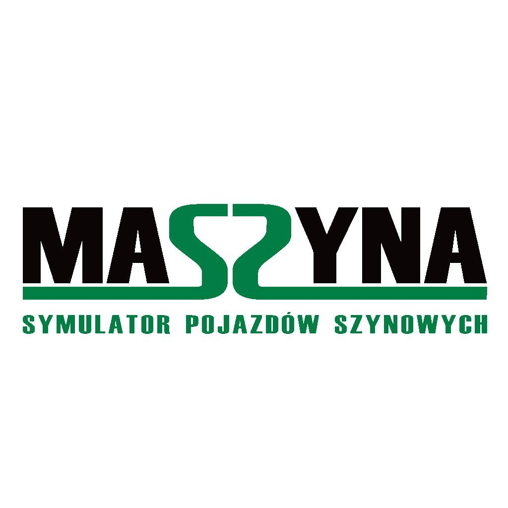

---
# Feel free to add content and custom Front Matter to this file.
# To modify the layout, see https://jekyllrb.com/docs/themes/#overriding-theme-defaults

layout: home
---

## Godot and MaSzyna EU07

**MaSzyna: Reloaded Core** is intended to be the technical foundation for the development
of a port of [MaSzyna Train Simulator](https://eu07.pl).

Resposibilities of the core:
* Implementation of High-Level APIs in core systems like **TrainSystem**,
  **Logging**, **EventSystem**.
* **Physics systems**, like [bridge to the original train physics system (aka MOVER)](wrapping-mover)
* Loaders, importers and exportes for legacy file formats: **E3D**,
  **FIZ**, **Materials**, **Sceneries**, **Asset Databanks**.
* Custom Godot nodes for developing vehicles, cabins, game objects and sceneries
* Renderers for tracks, roads, tractions and other custom visual
  elements

## Important topics

* [Overall architecture](architecture)
* [Wrapping the original MaSzyna physics](wrapping-mover)

## Knowledge base

### MaSzyna Train Simulator

* [FIZ files](https://wiki.eu07.pl/index.php/Plik_charakterystyki)
* [E3D format](https://wiki.eu07.pl/index.php/Format_E3D)
* [E3D format - Rainsted Wiki](http://rainsted.com/pl/Format_binarny_modeli_-_E3D)
* [MMD format](https://wiki.eu07.pl/index.php/Plik_multimedi%C3%B3w_(mmd))
* [MAT format](https://wiki.eu07.pl/index.php/Materia%C5%82y_-_Pliki_.mat)
* [Scenery file format](https://wiki.eu07.pl/index.php/Plik_scenerii)
* [Node objects](https://wiki.eu07.pl/index.php/Obiekt_node)

### Godot Game Engine

* [GDExtension documentation](https://docs.godotengine.org/en/stable/tutorials/scripting/gdextension/index.html)
* [Making plugins for Godot](https://docs.godotengine.org/en/stable/tutorials/plugins/editor/making_plugins.html)
* [Architecture: Why Godot is not ECS based engine](https://godotengine.org/article/why-isnt-godot-ecs-based-game-engine/)
* [Architecture: Not everything must be a Node](https://docs.godotengine.org/en/stable/tutorials/best_practices/node_alternatives.html)
* [Godot Multiplayer API](https://docs.godotengine.org/en/stable/tutorials/networking/high_level_multiplayer.html)
* [Godot Input handling](https://docs.godotengine.org/en/stable/tutorials/inputs/index.html)
* [Godot Assets pipeline](https://docs.godotengine.org/en/stable/tutorials/assets_pipeline/index.html)
* [Godot Materials](https://docs.godotengine.org/en/stable/tutorials/3d/standard_material_3d.html)
* [Godot Performance and optimization](https://docs.godotengine.org/en/stable/tutorials/performance/index.html#)

## The Mission

**MaSzyna: Reloaded** is a development organization dedicated to creating a next-generation train
simulator experience built with the Godot Engine. We leverage the power of [MaSzyna - Symulator
pojazdów szynowych](https://eu07.pl) by utilizing its assets and scenery elements, while offering
a modern and customizable platform for train enthusiasts and developers.

Our focus:

- **Modern Engine and Development Environment:** By utilizing Godot Engine, we aim to deliver a
  visually stunning and performant train simulator experience.

- **Community-Driven Development:** Open-source tools and contributions allow for collaborative
  development and user-driven features.

- **Customization and Modding Potential:** Our tools empower players and developers to personalize
  their train simulation experience through extensive customization options and modding capabilities.

## Authors

- **[Marcin Nowak](https://github.com/marcinn/)**: Software architecture and programming
- **[Karol "DoS" Tomaszewski](https://github.com/JezSonic)**: Game port concept, CI and programming
