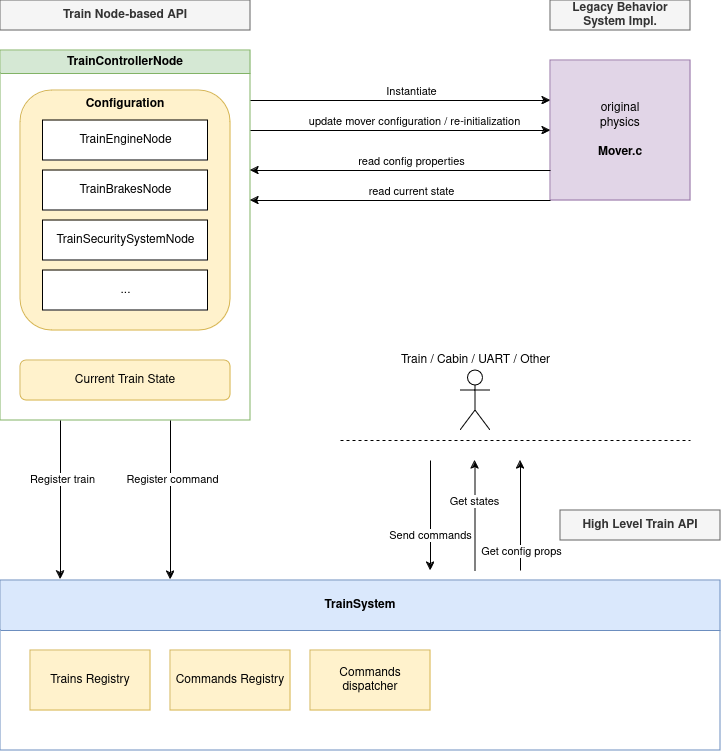

The MaSzyna project's vehicle simulation, implemented mostly as a
[Mover.cpp](https://github.com/eu07/maszyna/blob/master/McZapkie/Mover.cpp)
with surrounding classes, is appreciated all over the world.
Wrapping the original MaSzyna's physics is a core concept of making
a successful port of the simulator.

The goal is to expose internal MOVER's state in High-Level API
and MOVER's configuration through Godot Nodes &ndash; in a user-friendly and
standarized way.

Responsibility of Godot Nodes:
- integration with Godot's engine through Scene Tree
- encapsulation of complex and unreadable configuration of the legacy
  physics system (MOVER)
- bridge between High-Level Commands API and legacy physics system
  (MOVER) operations
- interface for flexible composition of rail vehicles
- optional internal communication through Godot Signals
- building the current and normalized state of the vehicle
- exposing the vehicle state and commands to the High-Level API


## Overall architecture



## Mapping key elements to a new architecture

| Element                       |MaSzyna EU07                         | MaSzyna: Reloaded 
|-------------------------------|-------------------------------------|------------------------------------------
| Vehicle data container        | FIZ files                           | Godot (T)SCN or res files
| Vehicle data loading + init   | cParser + Mover's `LoadFIZ_*()`     | Node properties + `_do_update_internal_mover()`
| Reading vehicle state         | Direct access to Mover's properties | Reading `Dictionary` with a complete state
| Modyfing vehicle state        | Direct calls to Mover's methods     | Direct calls to wrapped methods or sending commands
| Reading runtime config values | Direct property reading or calls    | Reading `Dictionary` with a runtime config
| Propagating trainset commands | Internal notification + TTrain refs | Using High-Level API commands

## Basic interface

### Extending TrainPart

`TrainPart` is a base class for implementing a logical subset of Mover's functionality. To completely wrap the Mover,
follow these steps:

* declare related class attributes as protected members
* define public enums
* imlement public setters and getters for protected members
* expose setters, getters and properties to Godot API (`ClassDB::bind_method()`, `ADD_PROPERTY()`)
* expose enums (`VARIANT_ENUM_CAST`, `BIND_ENUM_CONSTANT`)
* implement `_register_commands()` and `_unregister_commands()`, if necessary
* implement `_do_update_internal_mover()`, `_do_fetch_state_from_mover()`, `_do_fetch_config_from_mover()`,
  `_do_process_mover()`, if necessary
* (optionally) declare signals and emit them when necessary; for internal communication

#### **`TrainPart::_do_update_internal_mover(TMoverParameters *mover)`**

Updates a Mover instance based on node properties. The pointer to `TMoverParameters` is always set.
This method is called when node properties are chaning. It is an equivalent of Mover's `LoadFIZ_*` methods.

> NOTE: In the legacy game `LoadFIZ_*` logic was called just once while loading the scenery, so the state of a vehicle
> was always clean. MaSzyna Reloaded allows to re-configure vehicles at runtime, but the original Mover can produce
> unexpected results in such cases. A some "resetting" or re-initializing logic may be necessary to add here.


#### **`TrainPart::_do_fetch_state_from_mover(TMoverParameters *mover, Dictionary &state)`**

This method should read related attributes from `Mover` instance, and update `state` Dictionary respectively.


#### **`TrainPart::_do_fetch_config_from_mover(TMoverParameters *mover, Dictionary &config)`**

This method should read dynamic/precomputed Mover config values, and update `config` Dictionary respectively. 
The original Mover is mixing a vehicle state with it's characteristics like min/max values. These values should be
splitted due to performance isses, and for keeping up minimal set of state attributes. This method will be called only
after Mover's (re)initialization and will emit a `config_changed` signal.

Here is an example of brake handle config properties, where type of the handle is defined only as enum or string:

```cpp
    void TrainBrake::_do_fetch_config_from_mover(TMoverParameters *mover, Dictionary &config) {
        if (mover->Handle == nullptr) {
            return;
        }
        config["brakes_controller_position_min"] = mover->Handle->GetPos(bh_MIN);
        config["brakes_controller_position_max"] = mover->Handle->GetPos(bh_MAX);
    }
```

> NOTE: Changing `config` will emit signals


#### **`TrainPart::_do_process_mover(TMoverParameters *mover, double delta)`**

This method will be called on each `_process()` call (IDLE tick). Use it to wrap game loop methods.

Example:

```cpp
void TrainDoors::_do_process_mover(TMoverParameters *mover, double delta) {
    mover->update_doors(delta);
}
```


#### **`TrainPart::_register_commands()`**

Registers available commands and callbacks for the vehicle instance.
This method will be called when the vehicle will be added to the scene.

> NOTE: Callbacks must be exposed to the Godot API via `ClassDB::bind_method()`

Example:

```cpp
    void TrainDoors::_register_commands() {
        register_command("doors_left_permit", Callable(this, "permit_left_doors"));
        register_command("doors_right_permit", Callable(this, "permit_right_doors"));
        register_command("doors_left", Callable(this, "operate_left_doors"));
        register_command("doors_right", Callable(this, "operate_right_doors"));
    }
```

#### **`TrainPart::_unregister_commands()`**

Removes command callbacks for the vehicle instance. This method will be called when the vehicle will be removed
from the scene.

> NOTE: Callbacks must be exposed to the Godot API via `ClassDB::bind_method()`

Example:

```cpp
    void TrainDoors::_unregister_commands() {
        unregister_command("doors_left_permit", Callable(this, "permit_left_doors"));
        unregister_command("doors_right_permit", Callable(this, "permit_right_doors"));
        unregister_command("doors_left", Callable(this, "operate_left_doors"));
        unregister_command("doors_right", Callable(this, "operate_right_doors"));
    }
```

## Coding guidelines and limitations

### Which properties to wrap / expose

The goal is to build full compatibility with legacy exe, so:
* all handled properties of `FIZ` files must be mapped to node properties
* all methods used in command handles in the legacy `TTrain` must be wrapped as commands

But nothing more - Mover may contain unused code, which will be impossible to test.

### Naming conventions

#### Classes and attributes

* classes and enums should be properly prefixed
* keep consistency between names of attributes and setters/getters (`[set_|get_]some_value`):
  ```cpp
  int some_value = 0;

  void set_some_value(const int p_value);
  int get_some_value();
  ```
* prefix setter arguments with `p_`
* avoid redundancy in names
* try to keep short names, but do not use abbreviations (readibility counts)
* add comments, but only where necessary 

#### Train state and config

* use new, readable names
* use prefixes and unique key names
* keep consistency in naming schema
* use underscore instead of slash `/` (readibility, consistency with class attr names, unification)
* use only `[a-z0-9_]`

#### Commands

* use new, readable names
* use short names as possible (i.e. prefer `battery` over `battery_enable`)
* avoid the unclear combinations (i.e. `battery_toggle(false)` - toggle? or set/enable; or `battery_on("off")`)
* always prefix command names
* use only `[a-z0-9_]`

Example:

```gdscript

var state = {
    "battery_enabled": true,
    "battery_voltage": 110,
    "battery_damaged": false,

    "brakes_air_pressure": 0.5,
    "brakes_pipe_pressure": 0.5,

    "doors_locked": false,
    "doors_lock_enabled": fasle,

    "doors_left_open": true,
    "doors_left_remote_open": true,

    "doors_right_open": false,
    "doors_right_remote_open": false,
}
```

### Documentation

Documentation is important, because it is well integrated with Godot Editor. Well-documented classes, properties and
methods are available in the editor in a built-in documentation browser, tooltips and code completion/hinting. **Always
check the documentation before merging a pull-request**, and try to do the best before submitting a PR.

The goal of this project is also to clean up naming, so wrapped properties may have different names than in MOVER and 
FIZ files. That's why is very important to add a FIZ property name to properties description using this syntax:

```
[code]<FIZ Section>:<FIZ property name>[/code]
```

Example:

```xml
<member name="close/method" type="int" setter="set_door_close_method" getter="get_door_close_method" enum="TrainDoor.DoorControls" default="0">
    [code]Doors:CloseCtrl[/code]
    Determines method of closing doors
</member>
```
> Check: [CloseCtrl in Doors section](https://wiki.eu07.pl/index.php/Plik_charakterystyki#Doors:_.28Sekcja_drzwi.29)

This will help users to recognize properties.

Summing up:
* keep the docs up to date
* add `[code]` blocks for refrerincing `FIZ` properties

### Default values

In some cases handing defaults can be tricky, but they're crucial for compatibility. **Every property of a node wrapping
Mover must have a proper default value set**. Many FIZ files from the MaSzyna's data pack has no values set explicitely,
so some vehicle's properties are just working defaults or they are precomputed by Mover during parsing FIZ files.

To handle defaults properly:
* check [MOVER.h](https://github.com/eu07/maszyna/blob/master/McZapkie/MOVER.h) declaration
* check realated `LoadFIZ_*` section in the
  [original sources](https://github.com/eu07/maszyna/blob/master/McZapkie/Mover.cpp)
* if there are non-simple defaults, introduce some "unspecified" default value and add extra logic (see example for
  enums)

### Enums

* Exposing Mover's internal enums is prohibited
* Mixing Mover's enums with new ones is prohibited
* Must be exposed to Godot API (`VARIANT_ENUM_CAST`, `BIND_ENUM_CONSTANT`)
* Must start from `0` and be consecutive integers (0, 1, 2, ... and so on)
* Must be properly matched with `PROPERTY_HINT_ENUM`
* Must be properly mapped to Mover's enums
* Must be defined in a public class scope 
* Names and item names must be unique in a class scope
* Should be documented
* Should be introduced where original Mover is missing enums


#### TrainDoors::Voltage enum example

Definition in a header file:

```cpp
namespace godot {
    class TrainDoors { // class scope
        public: // must be public
            enum Voltage { // unique name in the class scope
                VOLTAGE_AUTO, // unique enum item names in a class scope (!)
                VOLTAGE_0,
                VOLTAGE_12,
                VOLTAGE_24,
                VOLTAGE_112,
            };
    };
}

VARIANT_ENUM_CAST(TrainDoors::Voltage)
```

Binding enum items in `cpp` file:

```cpp

namespace godot {
    void TrainDoors::_bind_methods() {
        BIND_ENUM_CONSTANT(VOLTAGE_AUTO)
        BIND_ENUM_CONSTANT(VOLTAGE_0)
        BIND_ENUM_CONSTANT(VOLTAGE_12)
        BIND_ENUM_CONSTANT(VOLTAGE_24)
        BIND_ENUM_CONSTANT(VOLTAGE_112)
    }
}
```

Declaration of a private attribute:

```cpp

namespace godot {
    class TrainDoors {
        // ...
        private:
            // setting VOLTAGE_AUTO as default is very important here!
            Voltage door_voltage = Voltage::VOLTAGE_AUTO;

        // ...
    }
}
```

Implementation of a door voltate setter and getter:

```cpp

void TrainDoors::set_door_voltage(const Voltage p_voltage) {
    door_voltage = p_voltage;
    _dirty = true; // mark vehicle config property changed
}

TrainDoors::Voltage TrainDoors::get_door_voltage() {
    return door_voltage;
}
```

Mapping `TrainDoorVoltage` enum to Mover's inernal values (for this property Mover has no enum defined) can be
implemented as `std::map`:

```cpp
namespace godot {
    class TrainDoors {
        private:
            const std::map<Voltage, int> voltageMap = {
                // notice missing VOLTAGE_AUTO - it can't be mapped
                {VOLTAGE_0, 0},
                {VOLTAGE_12, 12},
                {VOLTAGE_24, 24},
                {VOLTAGE_112, 112}
        };
    }
};
```

The final conversion:
* is an **one-way conversion**: from the node property to Mover's attribute,
* it **must** be implemented with a same logic as in Mover's `LoadFIZ_*` section,
* it **must handle default value**: a case, when `DoorVoltage` property is not declared in a `FIZ` file

The original code looks like:
```cpp

void TMoverParameters::LoadFIZ_Doors(std::string const &line) {
    // ...

    {
        auto const remotedoorcontrol {
            ( Doors.open_control == control_t::driver )
         || ( Doors.open_control == control_t::conductor )
         || ( Doors.open_control == control_t::mixed ) };

        extract_value( Doors.voltage, "DoorVoltage", line, ( remotedoorcontrol ? "24" : "0" ) );
    }

    // ...
}
```

The code above is trying to extract `DoorVoltage` value and store it in `Doors.voltage` attribute. But in case when
`DoorVoltage` is not defined in `FIZ` file or has no value set, `24V` will be used if doors are remotely controlled, 
`0V` otherwise.

The logic above **must** be re-implemented in `_do_update_internal_mover()`. To do it properly a case when value is not
set in the `FIZ` file must be handled properly, beacuse Mover is doing some extra checks and **finally handles two
possible default values**, depending on the other properties (`Doors.open_control` here).

Note that Godot node properties will use defaults, when they're not set explicitely in (t)scn/res files. In most cases
it is good enough to set a default value of the attribute to the same value as declared in `MOVER.h` or
`extract_value()`'s default argument. But in the `DoorVoltage` case we have two possible defaults!

Knowing that, the default value for a node property can't be set to "well-known" value like  `VOLTAGE_0`
(as in `MOVER.h` original header), because `0V` is a value which will be converted to `0` through `voltageMap`, and
the custom logic for setting a default value will not be executed. So there is necessity to **identify an "unspecified"
state**, and that's why **`VOLTAGE_AUTO` enum was introduced and set as a default**.

```cpp

TrainDoors::_do_update_internal_mover(TMoverParameters *mover) {
    // ...

    bool const remote_door_control = {(
        door_open_method == Controls::CONTROLS_DRIVER ||
        door_open_method == Controls::CONTROLS_CONDUCTOR ||
        door_open_method == Controls::CONTROLS_MIXED
    )};

    if (voltageMap.find(door_voltage) != voltageMap.end()) {
        // use well-known mapped values
        mover->Doors.voltage = voltageMap.at(door_voltage);
    } else {
        // handle "unspecified" case here
        mover->Doors.voltage = remote_door_control ? 24 : 0; // no enums in the Mover
    }

    // ...
}
```

### Command callbacks

Commands must be registered and unregistered via `TrainPart:_register_commands()` and
`TrainPart::_unregister_commands()` respectively. Because command callbacks are created in a runtime, they must be
exposed to the Godot API as public methods.

A smart approach is to define public methods that can be called in internal communication within the High-Level
Component.

Example:

```cpp
    void TrainDoors::operate_doors(const DoorSide p_side, const bool p_state) {
        TMoverParameters *mover = get_mover();
        ASSERT_MOVER(mover);
        mover->OperateDoors(p_side == Side::SIDE_LEFT ? side::left : side::right, p_state);
    }

    void TrainDoors::operate_left_doors(const bool p_state) {
        this->operate_doors(Side::SIDE_LEFT, p_state);
    }

    void TrainDoors::operate_right_doors(const bool p_state) {
        this->operate_doors(Side::SIDE_RIGHT, p_state);
    }
```

And the registration:

```cpp
TrainDoors::_register_commands() {
    register_command("doors_left", Callable(this, "operate_left_doors"));
    register_command("doors_right", Callable(this, "operate_right_doors"));
}
```

> NOTE: Method `operate_doors` is not exposed as a command, but due to this technique it is available for calling
> by `$Train/Doors.operate_doors()` directly, which can be handy in internal communication.

#### Argument type conversion

Godot uses `Variant` internally to transport variables of many types. Some of built-in types can be automatically casted
to primitives like `int` or `bool`, including enums (as they are plain `ints`). The types conversion works well for most
cases, even for `String`-type arguments passed to the command.

But for some cases it could introduce some problems, like for casting `String` to `bool`, where `bool("0") -> true`.
In such cases a [custom conversion is required](https://github.com/MaSzyna-Reloaded/MaSzyna-API-wrapper/issues/42).

### Mover bugs

You will find bugs in Mover. But the goal is to achieve full compatibiliy, so you must allow them to live.
If it was broken, then it must be still broken. Do not fix Mover (do not touch the original code). Do not implement
workarounds. [Report issue here](https://github.com/eu07/maszyna/issues) instead.
