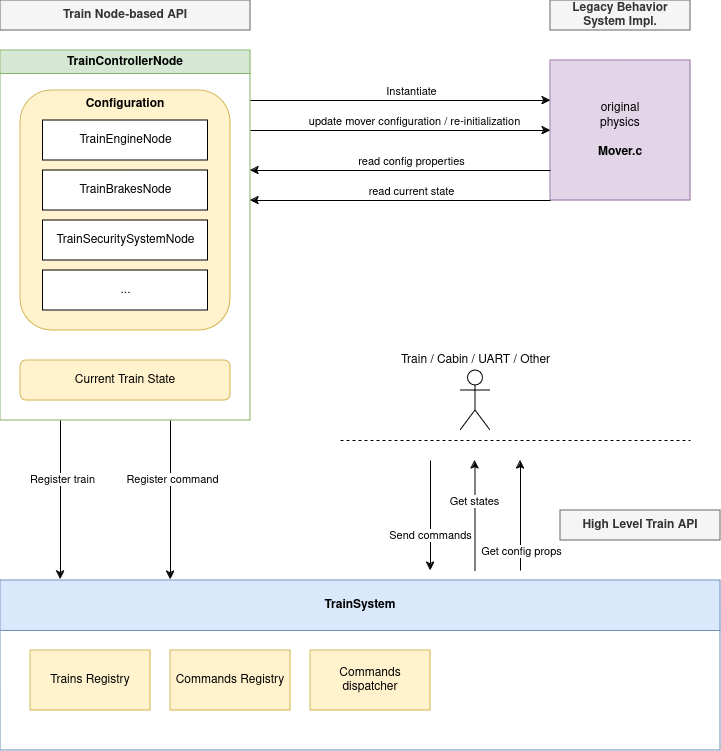

The MaSzyna project's vehicle simulation, implemented mostly as a
[Mover.cpp](https://github.com/eu07/maszyna/blob/master/McZapkie/Mover.cpp)
with surrounding classes, is appreciated all over the world.
Wrapping the original MaSzyna's physics is a core concept of making
a successful port of the simulator.

The goal is to expose internal MOVER's state in High-Level API
and MOVER's configuration through Godot Nodes &ndash; in a user-friendly and
standarized way.

Responsibility of Godot Nodes:
- integration with Godot's engine through Scene Tree
- encapsulation of complex and unreadable configuration of the legacy
  physics system (MOVER)
- bridge between High-Level Commands API and legacy physics system
  (MOVER) operations
- interface for semi-flexible composition of rail vehicles
- optional internal communication through Godot Signals
- building the current and normalized state of the vehicle
- exposing the vehicle state and commands to the High-Level API

## Overall architecture

### API Levels
